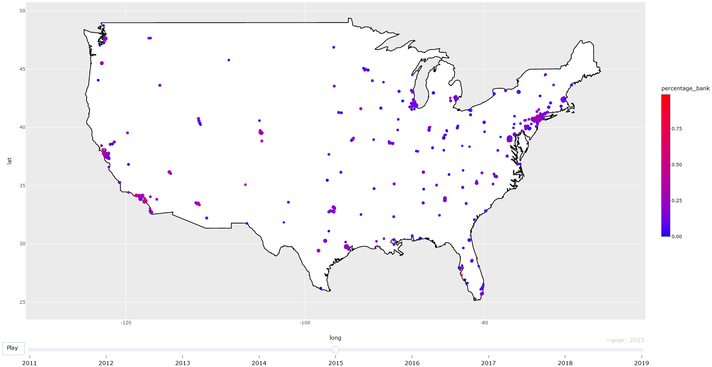

# IVF Clinic Data

City-level trends in egg-banking as percentage of all assisted reproductive therapy cycles, circle size proportional to total number of cycles in that city that year.

**Click on the above image to open an interactive version (you can hover over cities for more information, box-select to zoom in on a region, and watch an animated plot).**

The data are messy and year-to-year trends aren't always consistent (some cities just fall off the map suddenly, some cities' egg-banking percentages change suddenly, etc.), see below. However, the overall, nation-wide longitudinal trends are consistent.

&nbsp;

# About
Downloads clinic-level and national [CDC data on assisted reproductive therapy success rates](https://www.cdc.gov/art/artdata/index.html) going back to the 90s. After cleaning and harmonizing, aggregates data at the city level and plots some trends. 

# Data Issues
As with most CDC data, these data are messy. The biggest year-to-year changes are in the age-bucketing and the way cycles are counted. Also, in 2011, the CDC drastically changed the way they code ART cycle diagnoses (e.g., tubal factor disorder, diminished ovarian reserve, etc.). Prior to 2011, they only allowed for one diagnosis; but in 2011 they began allowing clinicians to choose multiple diagnoses, which throws all the data off. So, one cannot naively compare these pre- and post-2011 rates.

# Other
If one wanted to, they could analyze these data at the clinic, rather than the city, level. 

There are also many variables I didn't inlcude that one could analyze: for instance, variation in live birth rates among clinics over time, or the age composition of the cycles started at clinics (though, again, there are coding issues in the data that make this sort of analysis fraught). 
